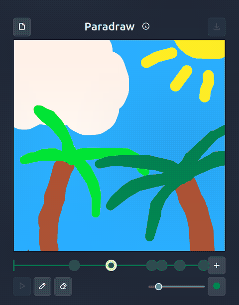

# Paradraw !

Hey ! I'm <a href="https://grifdail.fr/">Julien</a> and I made Paradraw.

Paradraw is a tiny tool to make drawing with a paralaxe effect

You can add layer with the "+" button bellow the canvas. Next to that, the slider you can adjust the depth of each layer. That's also where you select which layer you're currently editing.

At the bottom, you can switch between preview, draw and erase mode, as well as change the pen size and color. (I've bundled a few of my favorite color palette, I'll hope you'll like them.)

This tiny app was made in just a few day with VueJs. You can find the source code <a href="https://github.com/grifdail/paradraw">here</a>.
Everything run in your browser and no data is collected. Absolutely no generative AI or LLM were used in the creation of this app.

Have fun ! ❤️
